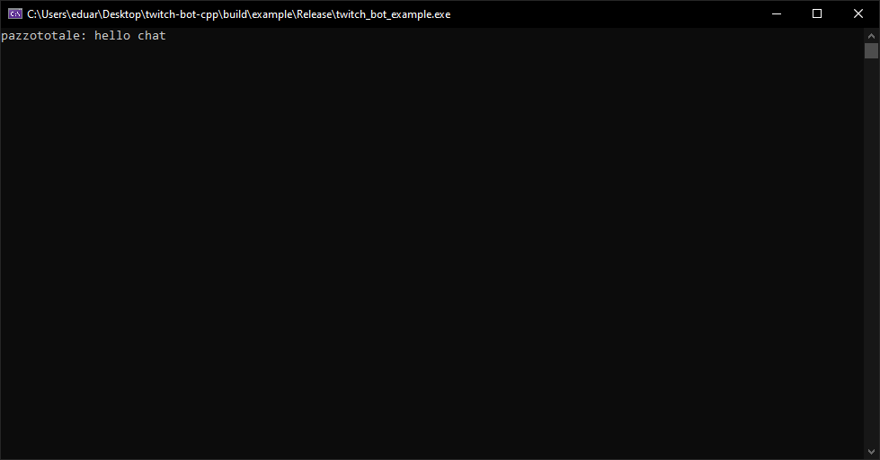

# TwitchBot - Header only library for creating twitch bots
Header only library for creating custom twitch bots. In order to use this library you need:

- C++ 20
- To include `twitch_bot.hpp`
- Create a `twb::Bot` object and bind callback functions you want to use.

**Example:**

```cpp
#include <iostream>
#include <twb/twitch_bot.hpp>

int main()
{
	std::string user = "<Username>";
	// Obtain password from: https://twitchapps.com/tmi/
	std::string pass = "<Password>";
	
	std::string channel = "<ChannelName>";

	twb::Bot myBot(user, pass);

	myBot.BindOnReceiveMessageCallback([&](const std::string& senderUsername, const std::string& senderMessage) {
		std::cout << senderUsername << ": " << senderMessage << std::endl;
		myBot.Message("Hi @" + senderUsername);
	});

	myBot.BindOnJoinChannelChatCallback([&]() { myBot.Message("Hello everyone, I just joined the chat!"); });
	myBot.ConnectTo(channel);

	return 0;
}
```

**Execution:**




## Callback functions
At the moment this library only support (**few**) callback functions for following events:

1. Bot join the chat, using `twb::Bot::BindOnJoinChannelChatCallback`.
2. A user send a message in channel chat, using `twb::Bot::BindOnReceiveMessageCallback`.

# Build example
I've prepared an example that you can use in order to start working on your awesome bot. To build it you can use *CMake*, for example as follows:

1. `mkdir build`
2. `cd build`
3. `cmake ..`

The `example/CMakeLists.txt` file shows you a simple and clean way to include this library in your project using CMake.


# Compatibility and test
This library compilation has been tested on following compilers:
- **Windows:** MSVC >= 2019
- **Linux:** GCC Version 9.3.0

# Contribute
Contributions are welcome, here's a list of possible features to work on:
* New events to which can be binded callback functions
* Additional `IRCMessage`(s)
* `IRCMessage` built from string (e.g.: `"PING :tmi.twitch.tv"` builds a `IRCMessage{.type = PING, .message = ":tmi.twitch.tv"}`)
* Better interface
* Test on *MacOS* and *Linux*